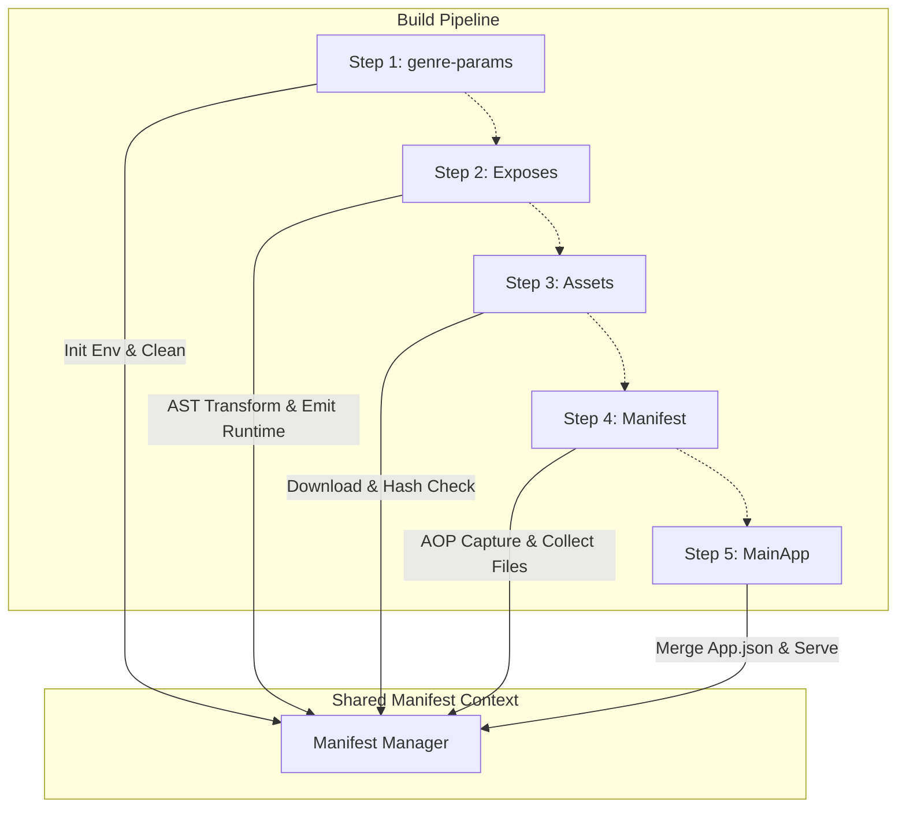

# 🚀 微信小程序微前端架构白皮书：@dd-code/uni-tools

> **核心理念**: 物理隔离 (Physical Isolation)、独立运行 (Independent Runtime)、运行时聚合 (Runtime Aggregation)
>
> **适用场景**: 大型微信小程序、多团队并行开发、巨石应用治理 (Monolith Governance)
>
> **资源链接**:
> *   [GitHub Repository](https://github.com/ChenYongChang1/dd-code-tools/tree/master/packages/uni-tools)
> *   [NPM Package](https://www.npmjs.com/package/@dd-code/uni-tools)

---

## 1. 背景：协作困境与架构演进

在多团队并行的大型业务场景下，传统的单体小程序架构（Monolith）逐渐暴露出严重的工程化瓶颈。当代码行数突破 50 万行，页面数量超过 500 个时，开发者面临的不仅仅是“慢”，而是“乱”与“险”。

### 1.1 协作摩擦 (Collaboration Friction)

*   **配置冲突地狱 (Configuration Hell)**
    多个业务线共用一个 `app.json`，路由定义 (`pages`)、分包配置 (`subPackages`)、预下载规则 (`preloadRule`) 经常互相覆盖。每次 Git Merge 都是一场心惊肉跳的排雷行动。一旦发生冲突，往往需要人工逐行比对 JSON，极易引入语法错误。

*   **发布阻塞 (Release Blocking)**
    A 团队的功能已验收，但 B 团队的代码存在 Bug，导致整个小程序无法发布。版本发布的节奏被最慢的团队拖累，紧急 Hotfix 流程极其繁琐，通常需要回滚大量代码才能摘出故障模块。

*   **权限管理缺失 (Permission Gap)**
    无法精确控制不同团队对特定业务模块的修改权限。实习生可能无意中修改了核心交易链路的公共组件，直到上线后才发现问题。

### 1.2 开发体验恶化 (DX Degradation)

*   **全量编译慢 (Slow Compilation)**
    随着文件数量的线性增长，构建工具（如 Webpack/Vite）的文件索引建立时间呈指数级上升。启动一次开发者工具需要 3-5 分钟，甚至更久。

*   **热更新 (HMR) 延迟**
    改动一行样式，等待 10s+ 才能在模拟器看到效果，严重打断开发心流。开发者不得不频繁手动编译，效率极低。

*   **调试困难 (Debug Nightmare)**
    开发一个简单的“营销活动页”，却被迫启动整个商城应用，加载大量无关的业务逻辑、全局状态和第三方 SDK。这不仅浪费资源，还经常因为主包代码报错而阻断子包的调试。

*   **内存溢出 (OOM)**
    本地开发服务经常因为内存占用过高而崩溃，Node.js 进程频繁退出，需要反复重启。

### 1.3 模块隔离缺失 (Lack of Isolation)

*   **样式污染 (Style Leakage)**
    全局样式 (`app.wxss`) 无意间影响了局部组件，或者组件间的样式类名冲突。虽然 Shadow DOM 可以解决部分问题，但在小程序环境中兼容性仍有坑。

*   **依赖耦合 (Dependency Coupling)**
    不同业务模块随意引用对方的代码，导致“改一处坏处处”，维护成本指数级上升。例如，订单模块直接引用了用户模块的内部函数，当用户模块重构时，订单模块随即崩溃。

*   **幽灵依赖 (Phantom Dependencies)**
    子包使用了主包未声明的 npm 依赖，导致在分包独立加载时（微信小程序的分包异步化场景）出现模块丢失错误。

**我们需要的架构：让每个业务模块都能像“独立应用”一样开发、调试，最后在运行时无缝聚合成一个完整的小程序。**

---

## 2. 解决方案：基于 Vite 的微前端架构

`@dd-code/uni-tools` 是一套基于 Vite 插件生态的小程序微前端解决方案，它提供了一种小程序的开发流。
主要方案是通过uni的subpackages 将子模块单独打包，然后通过cdn 拉取其他模块的代码，整合在一起后，同步更新app.json 实现融合

### 2.1 物理隔离 (Dev Isolation)

每个子应用（Sub App）本质上都是一个**独立的 Vite 项目**。我们推荐采用 Monorepo 结构管理，确保代码物理边界清晰。

#### 推荐目录结构

```text
root/
├── apps/
│   ├── main-app/          # 主应用（基座）：包含 TabBar、公共组件、登录态
│   │   ├── src/
│   │   ├── vite.config.ts
│   │   ├── mfe.json       # 微前端配置文件
│   │   └── dist/          # 构建产物
│   ├── sub-marketing/     # 营销子应用：独立开发，独立仓库
│   │   ├── src/
│   │   └── vite.config.ts
│   ├── sub-order/         # 订单子应用
│   └── sub-user/          # 用户中心
├── packages/
│   ├── ui/                # 公共 UI 组件库 (Pure Components)
│   └── runtime/           # 运行时共享库 (axios, store, utils)
├── node_modules/
│   └── @dd-code/
│       └── uni-files/     # [Cache] 远程子应用产物缓存目录
├── vite.config.ts         # 统一构建配置
└── package.json
```

*   **独立启动**：`npm run dev:sub-marketing` 仅启动营销业务，零噪音，启动速度 < 1s。
*   **独立构建**：每个子应用产出独立的 `sub-marketing` 分包目录，互不干扰。
*   **独立发布**：支持单独构建子应用产物并上传 CDN，主应用按需更新依赖。

### 2.2 运行时聚合 (Runtime Aggregation)

不同于 Web 微前端（如 Qiankun）在浏览器端动态加载 JS，小程序受限于沙箱环境（禁止 `new Function`, `eval`），必须在**编译后、运行前**完成聚合。我们采用了 **"HTTP 服务发现 + 本地文件同步"** 的联调模式。

#### 2.2.1 独立开发模式 (Standalone Mode)

适用于专注开发某个特定子应用，不需要实时修改其他应用代码的场景。

1.  **依赖拉取**: 构建启动时，插件会读取配置，获取主应用及其他子应用的资源清单。
2.  **缓存校验**: 检查本地 `node_modules` 缓存，对比 Hash 值。若有更新，自动从 CDN 拉取最新产物。
3.  **环境组装**: 构建结束时，将缓存中的主应用和其他子应用产物同步到当前子应用的 `dist` 目录。
4.  **结果**: 开发者在 `dist` 目录下获得一个完整的、可运行的小程序，其中包含最新的主应用基座和当前的子应用代码。

#### 2.2.2 联调开发模式 (Integrated Mode)

适用于需要同时修改主应用和子应用，或进行跨应用联调的场景。

1.  **主应用启动**: 运行主应用 (`npm run dev:main`)，启动 HTTP/WebSocket 服务 (Port 3561) 等待连接。
2.  **子应用接入**: 运行子应用 (`npm run dev:sub`)，插件向主应用服务发起握手请求，获取主应用的物理磁盘路径。
3.  **输出重定向**: 子应用动态修改 `build.outDir`，将构建产物直接输出到主应用的 `dist` 目录下 (e.g., `main-app/dist/dev/mp-weixin/sub-marketing`)。
4.  **实时融合**: 主应用监听到子应用产物写入后，自动更新 `app.json`，实现“热插拔”式的联调体验。

#### 详细握手流程

1.  **服务发现 (Service Discovery)**
    *   主应用启动时，开启 HTTP 服务 (Port `3561`)，提供 `/root-path` 接口，暴露其环境变量。
    *   主应用同时启动 WebSocket Server，监听 `/root-path` 升级请求。

2.  **握手 (Handshake)**
    *   子应用启动时，`WsClientServer` 尝试连接 `ws://localhost:3561/__mfe__ws__?appCode=sub-marketing`。
    *   连接建立后，主应用 `WsServer` 记录客户端映射，并发送 `INIT` 消息，包含主应用的物理输出路径 (`pwd`)。

3.  **重试机制 (Retry Policy)**
    *   如果主应用未启动，子应用会每隔 3 秒尝试重连 (`retryConnect`)，确保开发顺序的灵活性（先启子应用也没问题）。
    *   代码实现参考：`packages/uni-tools/src/plugins/modules/mp-weixin/server/index.ts`

4.  **同步 (Synchronization)**
    *   收到 `pwd` 后，子应用启动文件监听器，将构建产物（JS/WXSS/JSON/WXML）直接写入主应用的分包目录。

5.  **热更 (HMR)**
    *   微信开发者工具监测到文件变化，自动触发增量编译。

---

## 3. 核心原理：插件链 (Plugin Chain Deep Dive)

微前端的构建流程本质上是一个**有序的插件流水线**。我们设计了 `createMpWeixinUniPlugin`，它初始化了一个共享的 **Manifest Manager** 上下文，并按特定顺序注册了 5 个核心插件。

### 3.1 核心大脑：Manifest Manager

所有插件共享同一个状态对象 `manifestJson`。它不仅是构建时的内存缓存，也是最终产出 `manifest.json` 的数据源，用于描述应用的依赖关系、产物列表和版本指纹。

#### IManifestJson 接口定义
```typescript
export interface IManifestJson {
  code: string;         // 小程序的标识
  appCode: string;      // 当前小程序下各个应用唯一标识 (e.g., 'sub-marketing') 子应用打包的内容会在前面添加这个路径 subpackages
  mode: string;         // 构建模式 (dev/prod)
  hash: string;         // 内容指纹 (SHA256)，用于增量更新检测
  files: IFileRow[];    // 产物文件列表 (js, wxss, json, assets)
  pagesJson: any;       // 路由配置 (pages.json)，用于主应用路由合并
  dependencies: IManifestJson[]; // 依赖的子应用列表
  exposes: Record<string, IExposeInfo>; // 导出的共享模块
  cdn: string;          // CDN 根路径
  publicPath: string;   // 资源公共路径 包含环境 code appCode
}

export interface IExposeInfo {
  path: string;         // 模块相对路径
  exports: string[];    // 导出变量名列表
}
```

### 3.2 插件流水线详解

我们严格控制插件的 `enforce` 顺序，确保从环境准备到产物聚合的每一步都精确执行。

#### Step 1: 环境准备 (`@dd-code:genre-params`)
> **Enforce: `pre`**

*   **Init**: 初始化 `ManifestManager` 环境信息 (Mode, CDN, AppCode)。
*   **Clean**: 清空 `PUBLISH_PATH` (`dist/publish`)，防止旧产物污染。
*   **Reset**: 重置 Vite `outDir`，确保构建输出到正确的临时目录 (`node_modules/@dd-code/current-files`)。这一步至关重要，因为它防止了子应用构建污染项目根目录，保持了工作区的整洁。

#### Step 2: 运行时共享 (`createExposesPlugin`)
> **Enforce: `post`** | **File**: `plugins/exposes.ts`

**挑战**：小程序不支持动态 `new Function`，无法使用 Webpack Module Federation 的远程加载模式。
**方案**：**静态 AST 分析 + 相对路径重写**。

1.  **拦截**: 插件监听所有模块 ID，识别符合 `RUNTIME_NAME_REGEXP` (即 `@dd-code/runtime`) 的导入语句。
    *   例如：`import { axios } from '@dd-code/runtime/axios'`

2.  **重写**:
    *   读取主应用的 `manifest.json` 中的 `exposes` 字段，找到 `axios` 对应的真实文件路径（例如 `main-app/utils/request.js`）。
    *   计算当前子应用分包目录（`sub-marketing`）到主应用公共目录的**相对路径**。
    *   生成 CommonJS 代码，替换原生 import。

3.  **多级支持**: 支持 `.` (根导出) 和 `./name` (子模块导出) 的映射。

```typescript
// plugins/exposes.ts
const renderRuntimeCode = (moduleExpose: IExposeInfo, appCode: string) => {
  // 计算相对路径：从子应用构建目录 -> 主应用根目录
  // buildName: mfe_runtime/__mfe_{template}_runtime__.js
  const deepPath = path.relative(path.join(appCode, path.dirname(buildName)), ".");
  let resultCode = "";
  const { exports: exportName = [], path: filePath } = moduleExpose || {};

  // 生成代码: export const { axios } = require('../../main-app/utils/request.js');
  exportName.forEach((item) => {
    resultCode += `export const {${item}} = require('${deepPath}/${filePath}');`;
  });
  return resultCode;
};
```

4.  **Emit**: 显式 `emitFile` 生成物理文件。这是一个关键 Hack，因为小程序编译器会检查 `require` 的文件是否存在。我们必须在构建产物中生成这个“桥接文件”，即使它只是一个空壳或简单的导出转发。

#### Step 3: 资源同步与依赖注册 (`createAppsAssetsPlugin`)
> **Enforce: `pre`** | **File**: `plugins/assets.ts`

在构建开始前，确保所有依赖的子应用资源都已就位。

*   **Download**: 基于 `manifest.json` 的 Hash 比对。只有当远程 CDN 的 Hash 与本地缓存不一致时，才下载新的子应用包。
    *   **缓存路径**: `node_modules/@dd-code/uni-files`。利用 `node_modules` 缓存机制，避免重复下载。
    *   **并发下载**: 使用 `Promise.all` 并发拉取多个子应用。
    *   **过期检测**: `checkDownloadFilesIsExpired` 逻辑确保本地缓存有效性。
    *   **进度条**: 使用 `CliProgressManager` 展示多线程下载进度，提升 CLI 体验。
*   **Sync**: 将下载的资源移动到主应用的输出目录。
*   **Register**: 将子应用的 Manifest 注入到当前上下文的 `dependencies` 中，供后续 `app.json` 合并使用。

```typescript
// plugins/assets.ts
export const createAppsAssetsPlugin = (manifestJson) => ({
  name: "@dd-code:apps-assets",
  async options() {
    // 1. 下载依赖应用 (Hash 校验 + 多线程并发)
    manifestList = await downloadFullApps(manifestJson.value);
    // 2. 注册依赖
    manifestJson.setDependencies(manifestList);
  },
  buildStart() {
    // 3. 移动资源到输出目录 (跳过 build 模式下的子应用)
    if(checkIsBuildInChild() && !manifestJson.value.isRoot) return
    moveOtherApps({ base: basePath, manifestList });
  }
});
```

#### Step 4: 产物与路由采集 (`createManifestPlugin`)
> **Enforce: `default`** | **File**: `plugins/manifest-plugin.ts`

**挑战**：Vite 插件无法感知 `uni-app` 内部的静态资源复制（如 `static/logo.png` 是由 `uni-cli-shared` 直接拷贝的，不经过 Rollup 管道）。如果只收集 Rollup bundle，会导致静态资源丢失。
**方案**：**AOP 切面编程**，劫持文件观察者。

*   **AOP Hook**: 通过 `addUniCopyPluginHook` 动态修改 `FileWatcher.prototype.copy`，在原生的复制行为前后插入钩子。

```typescript
// utils/copy.ts
// 劫持 uni-cli-shared 的文件复制行为
FileWatcher.prototype.copy = function (from) {
  before?.(from, to); // -> 记录文件到 Manifest
  const result = originalCopy.call(this, from);
  return result;
};
```

*   **Collect**: 在 `writeBundle` 阶段收集所有 JS/CSS chunk，结合 Hook 捕获的静态资源，生成完整的文件指纹列表。
*   **Persist**: 生成 `mfe-uni-manifest.json` 并保存到发布目录。这个 Manifest 是后续版本校验和增量更新的凭证。

#### Step 5: 应用聚合与联调服务 (`createMainAppPlugin`)
> **Enforce: `post`** | **File**: `plugins/main-app.ts`

**挑战**：开发模式下，主应用和子应用同时修改文件，极易触发**无限循环编译**（Loop Compilation）。
*   场景：子应用修改 -> 触发主应用编译 -> 主应用编译修改 Manifest -> 触发子应用监听 -> 子应用再次写入 -> 无限循环。

**方案**：**双重锁机制 (Double Lock Mechanism)**。

1.  **JSON Lock (App.json)**:
    合并子应用的 `pages.json` 到主应用 `app.json` 时，先进行深度比较 (`JSON.stringify`)。只有内容实质变化才写入磁盘。
    *   **合并策略**: 自动合并 `pages`, `subPackages`, `preloadRule` 等关键字段。
    *   **去重**: 自动去除重复定义的页面路径。

2.  **Buffer Lock (File Sync)**:
    子应用向主应用同步文件时，对比源文件和目标文件的 **Buffer 内容**。即使文件修改时间 (mtime) 变了，只要二进制内容一致，就**跳过写入**。

```typescript
// utils/copy.ts
const sb = fs.readFileSync(sourcePath);
const tb = fs.readFileSync(targetPath);
// 只有二进制内容不同才写入，阻断无限 HMR
if (!sb.equals(tb)) fsExtra.copySync(sourcePath, targetPath);
```

---

## 4. 配置指南 (Configuration Guide)

### 4.1 配置文件 `mfe.json`

在项目根目录下创建 `mfe.json`，用于定义应用拓扑结构。

| 字段名 | 类型 | 必填 | 描述 |
| :--- | :--- | :--- | :--- |
| `platform` | `string` | 是 | 目标平台，目前支持 `mp-weixin` |
| `apps` | `Array` | 是 | 依赖的子应用列表 |
| `apps[].appCode` | `string` | 是 | 子应用唯一标识，需与 `package.json` name 保持一致或通过 env 指定 |
| `apps[].repoUrl` | `string` | 否 | 仓库地址，用于文档记录或自动化工具 |

示例：
```json
{
  "platform": "mp-weixin",
  "apps": [
    {
      "appCode": "main-app",
      "repoUrl": "git@github.com:org/main-app.git"
    },
    {
      "appCode": "sub-marketing",
      "repoUrl": "git@github.com:org/sub-marketing.git"
    }
  ]
}
```

### 4.2 环境变量 (Environment Variables)

我们通过环境变量控制构建行为，通常配置在 `.env` 或 `package.json` scripts 中。

| 变量名 | 描述 | 默认值 | 示例值 |
| :--- | :--- | :--- | :--- |
| `MFE_UNI_CODE` | 当前应用的唯一标识 | - | `dd-code` |
| `MFE_APP_CODE` | 当前应用的唯一标识 | - | `sub-marketing` |
| `UNI_IS_ROOT` | 是否为主应用 (基座) | `false` | `true` |
| `MFE_CDN_HOST` | 产物发布的 CDN 域名 | - | `https://cdn.example.com` |

### 4.3 Vite 插件配置选项 (`IUniConfigOptions`)

`createMpWeixinUniPlugin` 接受一个配置对象：

```typescript
export interface IUniConfigOptions {
  /**
   * 模块导出配置
   * key: 导出的模块名称，'.' 代表默认导出
   * value: 模块对应的本地文件路径 (相对于项目根目录)
   */
  exposes?: Record<string, string>;
}
```

配置示例 (`vite.config.ts`):

```typescript
import { defineConfig } from "vite";
import uni from "@dcloudio/vite-plugin-uni";
import { createMpWeixinUniPlugin } from "@dd-code/uni-tools";

export default defineConfig({
  plugins: [
    uni(),
    // 注入微前端插件链
    ...createMpWeixinUniPlugin({
      exposes: {
        // 配置需要共享给子应用的模块 (仅主应用需要)
        '.': 'src/store/index.ts',
        './axios': 'src/utils/request.ts',
        './user': 'src/store/user.ts'
      }
    }),
  ],
  build: {
    // 必须开启 minify 以减小体积，但开发模式可关闭
    minify: process.env.NODE_ENV === 'production',
    // 生产环境开启 sourceMap 有助于错误追踪
    sourcemap: process.env.NODE_ENV !== 'production'
  }
});
```

---

## 5. 进阶话题 (Advanced Topics)

### 5.1 CI/CD 集成与版本控制

在生产环境中，子应用应独立发布。我们推荐的 CI/CD 流程如下：

1.  **子应用构建**:
    ```bash
    npm run build:mp-weixin
    ```
2.  **产物上传**:
    将 `dist/publish` 目录下的所有文件上传至 CDN。
    路径规范：`{CDN_HOST}/{mode}/static-repository/mfe-uni/{code}/{appCode}/`
3.  **主应用构建**:
    主应用构建时，会自动读取 `mfe.json` 中的 `apps` 列表，根据 `appCode` 从 CDN 拉取最新的 `manifest.json`，并校验 Hash。
    *   **Hash 一致**: 复用本地缓存，构建速度秒级。
    *   **Hash 变更**: 下载新文件，确保版本最新。

### 5.2 共享依赖的最佳实践

为了极致的分包体积优化，建议将所有公共依赖下沉到主应用。

*   **纯 JS 库 (lodash, dayjs)**:
    在主应用安装，通过 `exposes` 导出。子应用通过 `@dd-code/runtime` 引用。
    *   **优点**: 子应用构建产物中不包含这些库的代码，体积大幅减小。
    *   **缺点**: 本地开发需要主应用启动支持。

*   **UI 组件库 (Vant, TDesign)**:
    *   **方案 A (推荐)**: 子应用独立安装，利用小程序的分包异步化 (Component Placeholder) 特性。
    *   **方案 B**: 主应用全局注册组件，子应用直接使用标签（无代码引用）。需要严格的文档约束，防止子应用使用了主应用未注册的组件。

### 5.3 性能调优 (Performance Tuning)

*   **分包预下载 (Preload)**:
    利用 `app.json` 的 `preloadRule`，在进入主包页面时闲时下载子包资源。微前端架构会自动合并各子应用的 preload 配置。
*   **Tree Shaking**:
    确保 `vite.config.ts` 中开启 `build.minify`。对于共享库，尽量使用 ES Module 导出，以便 Rollup 进行静态分析和摇树优化。

---

## 6. 开发者指南 (Developer Guide)

如果您想为本工具贡献代码，或者开发自定义插件，以下信息对您很重要。

### 6.1 目录解剖 (Anatomy)

构建过程中，文件系统会发生以下变化：

*   `node_modules/@dd-code/uni-files`: 缓存下载的远程子应用产物。结构为 `{env}/{appCode}/...files`。
*   `dist/publish`: 最终发布的产物目录，包含 `manifest.json` 和资源文件。
*   `dist/dev/mp-weixin` : 最终运行在开发者工具的目录，聚合了所有子应用和主应用的代码。

### 6.2 调试技巧 (Debugging)

*   **查看 Manifest**: 构建完成后，检查 `dist/publish/mfe-uni-manifest.json`。确认 `files` 列表是否完整，`exposes` 是否正确。
*   **断点调试**: 在 `createMpWeixinUniPlugin` 处打断点，观察插件注册顺序和 `ManifestManager` 的状态变化。
*   **强制更新**: 如果怀疑缓存有问题，可以手动删除 `node_modules/@dd-code` 目录，强制重新下载和构建。

### 6.3 扩展插件示例 (Custom Plugin Example)

如果您需要在一个构建流程中插入自定义逻辑（例如上传 sourceMap 到 Sentry），可以编写一个标准的 Vite 插件，并利用 `ManifestManager` 上下文。

```typescript
// plugins/sentry-plugin.ts
import { IManifestJson } from "@dd-code/uni-tools";

export const createSentryPlugin = (manifestJson: { value: IManifestJson }) => ({
  name: "my-sentry-plugin",
  enforce: "post",
  closeBundle() {
    if (manifestJson.value.mode === 'production') {
      const { files, appCode, hash } = manifestJson.value;
      console.log(`Uploading ${files.length} files for ${appCode} (Hash: ${hash})...`);
      // uploadToSentry(files);
    }
  }
});
```

然后在 `vite.config.ts` 中注册：

```typescript
import { createSentryPlugin } from './plugins/sentry-plugin';
import { createManifestManager } from '@dd-code/uni-tools';

const manifest = createManifestManager(); // 注意：通常由 createMpWeixinUniPlugin 内部管理，这里仅作示意

export default {
  plugins: [
    ...createMpWeixinUniPlugin(),
    createSentryPlugin(manifest) // 需修改 core 暴露 manifest 实例，或通过 hook 获取
  ]
}
```

### 6.4 产物目录详解 (Dist Tree)

最终在 `dist/dev/mp-weixin` 下的结构如下：

```text
dist/dev/mp-weixin/
├── app.json                # 合并后的全局配置
├── app.js
├── pages/                  # 主应用页面
│   └── index/
├── sub-marketing/          # [子应用] 营销分包
│   ├── pages/
│   ├── static/
│   └── common/             # 子应用私有公共模块
├── mfe_runtime/            # [核心] 运行时桥接目录
│   └── __mfe_sub-marketing_runtime__.js  # 营销子应用对主应用的引用代理
└── common/vendor.js        # 主应用提取的公共依赖
```

---


## 7. 故障排查 (Troubleshooting)

#### Q1: 启动报错 `EADDRINUSE: 3561`
*   **原因**: 端口 3561 被占用，通常是另一个主应用实例未关闭，或者 IDE 崩溃后进程残留。
*   **解决**:
    ```bash
    lsof -i :3561 | grep LISTEN | awk '{print $2}' | xargs kill -9
    ```

#### Q2: 子应用修改代码后，模拟器未刷新
1.  检查主应用是否开启了服务 (`npm run dev:mp-weixin`)。
2.  检查子应用控制台是否打印 `[Connected] Main App Server`。
3.  检查 `app.json` 是否合并失败（查看主应用控制台报错）。
4.  **强制刷新**: 删除主应用 `dist` 目录，重启主应用。

#### Q3: 运行时报错 `module not found`
*   检查 `exposes` 配置是否正确。
*   确认子应用引用的路径是否匹配 `exposes` 的 key (e.g. `@dd-code/runtime/axios` vs `@dd-code/runtime/request`)。
*   检查主应用构建产物中是否真的生成了对应的 JS 文件。

#### Q4: 样式丢失或错乱
*   确认子应用是否正确使用了 `scoped` 样式。
*   检查是否使用了全局标签选择器 (e.g. `view { color: red }`) 污染了全局。

#### Q5: `manifest.json` Hash 不匹配导致无限下载
*   **原因**: 本地计算的 Hash 算法与服务端/CDN 上的不一致，或者文件传输过程中被篡改。
*   **解决**: 检查 `checkDownloadFilesIsExpired` 逻辑，确保 `hash` 字段在 `manifest.json` 生成时是确定的（例如按文件名排序后计算）。

---

## 8. 架构总结图



## 9. 结语

`@dd-code/uni-tools` 不仅仅是一个构建工具，它是一套完整的**小程序微前端治理体系**。通过严格的物理隔离和灵活的运行时聚合，它成功解决了巨石应用的维护难题，让百人团队协作成为可能。

| 核心能力 | 技术实现 | 价值 |
| :--- | :--- | :--- |
| **独立开发** | Monorepo + Vite Multi-Config | 提升编译速度 10x，解耦团队协作 |
| **运行时共享** | Static AST Analysis + Relative Path | 降低包体积，复用公共逻辑 |
| **增量更新** | Manifest Hash + Content Addressable | 节省带宽，精准控制版本 |
| **无缝聚合** | HTTP Discovery + Double Lock | 还原原生开发体验，零感知联调 |
